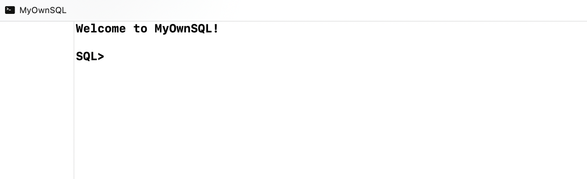
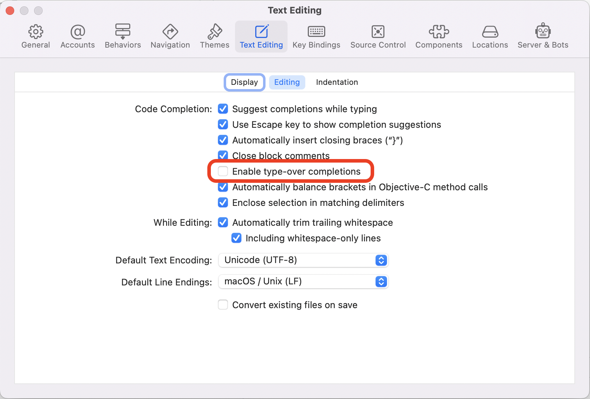

# Purpose

This project is based on a really informative and helpful set of blog posts on how to create a SQL parser and execution engine [beginning here](https://notes.eatonphil.com/database-basics.html). Unlike that implementation, this is one is done in Swift and (hopefully properly) takes advantage of the idioms of that language rather than simply being a transliteration of Go code.

# Quick start

Use Xcode to open the `MyOwnSQL.xcodeproj` file. To run the test suite, select the `MyOwnSQLTests` scheme, click on the ☑️ icon to show the test navigator, then click the ▸ icon on the top right of the navigator. To run the REPL within Xcode and execute queries, select the `MyOwnSQL` scheme and click the the large ▸ icon. You  should see the following in the console:



You may have to adjust the editing settings within Xcode so that hitting backspace works properly within the REPL. Do the following:

* go to the Xcode menu
* select Preferences...
* click the Text Editing tab
* click the Editing tab within that
* uncheck "Enable type-over completions"



# Features

This project is still under active development, so the feature set is still in flux. Statements must be delimited by a semicolon character. Keywords can be uppercased or lowercased.

## Creating tables

The syntax for creating a new table is the following:

```
CREATE TABLE table_name (column_definition1, ...);
```

... where there can be one of more column definitions. Column definitions are of the form:

```
column_name column_type
```

As of this time, only `INT`, `TEXT`, and `BOOLEAN` types are supported. Below is an example statement:

```
CREATE TABLE clothes(id INT, description TEXT, is_fabulous BOOLEAN);
```

If you enter that into the REPL, it should respond with `Table created.'

It should be noted that currently it is not possible to perform a so-called CTAS (create-table-as-select) statement. Also, there is currently no support for autoincrementing columns that are typically used for primary keys.


## Inserting into tables

Records can be inserted into an existing table using the following `INSERT` statement:

```
INSERT INTO table_name VALUES (expression1, ...);
```

... where each expression is a literal value. Below is an example statement:

```
INSERT INTO clothes VALUES (1, 'Velvet dress', true);
```

If you enter that into the REPL, and assuming the table above exists, it should respond with `One row inserted.'

Note that at this time, you must insert values for _all_ columns that exist in the table; there is currently no support for nullable columns. Also,it is not possible to insert into a table using a select clause.

## Selecting from tables

The syntax for selecting from a table is the following:

```
SELECT expression1, ... FROM <<table_name>>;
```

... where each expression is either a literal value or a column with the option to use an `AS` clause to create an alias for a column. The following is an example statement:

```
select id, description, is_fabulous from clothes;
```

If you entered the previous statements, the REPL should look something like this:

```
| id | description  | is_fabulous |
===================================
| 1  | Velvet dress | true        |
```

There are a few other limitations at this time:

* no support for WHERE clauses... yet
* no joins are allowed yet; you can only `SELECT` from one table at a time